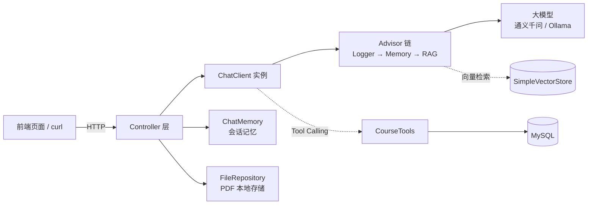

# heima-ai · Spring AI 智能应用集合


基于 **Spring Boot 3.4 + Spring AI 1.0.1** 构建的一套 AI 对话应用集合，用一个后端工程覆盖了大模型应用开发的几条主线：**多模态对话、会话记忆、Tool Calling、RAG 检索增强、流式输出**。

项目包含 5 个可独立体验的场景，每个场景对应一个独立的 `ChatClient` 实例（各自持有独立的 System Prompt 与 Advisor 链），互不干扰。

---

## 功能特性

| 模块 | 接口 | 能力说明 | 涉及技术 |
| --- | --- | --- | --- |
| 通用多模态对话 | `GET、POST /ai/chat` | 带人设的日常助手「小团团」，支持文本对话，也支持上传图片让模型理解图片内容 | `Media` + `MimeType` 多模态、`Flux` 流式输出 |
| 哄哄模拟器 | `GET /ai/game` | 角色扮演游戏：模型扮演生气的女友，根据用户回复增减「原谅值」，到 100 通关、到 0 失败 | System Prompt 工程、状态机式对话约束 |
| 智能客服 | `GET /ai/service` | 职业教育机构的课程咨询 + 试听预约，模型自主决定何时查课程、查校区、下单预约 | **Tool Calling**（`@Tool` / `@ToolParam`） |
| PDF 文档问答 | `GET /ai/pdf/chat` | 上传 PDF 后基于文档内容问答，答案受限于文档，不支持文档外的问题 | **RAG**：`PagePdfDocumentReader` + `QuestionAnswerAdvisor` |
| 会话历史 | `GET /ai/history/{type}` | 查询各业务下的会话 ID 列表，以及单个会话的完整消息记录 | `ChatMemory`、`MessageWindowChatMemory` |

---

## 技术栈

| 分类 | 选型 |
| --- | --- |
| 语言 / 运行时 | Java 17 |
| 基础框架 | Spring Boot 3.4.8、Spring Web |
| AI 框架 | Spring AI 1.0.1（`spring-ai-starter-model-openai`、`spring-ai-starter-model-ollama`、`spring-ai-pdf-document-reader`、`spring-ai-advisors-vector-store`、`spring-ai-rag`） |
| 持久层 | MyBatis-Plus 3.5.10.1、MySQL 8 |
| 其他 | Lombok 1.18.24、Reactor（流式响应） |
| 对话模型 | 阿里云百炼 `qwen-max-latest`（主力）、`qwen-omni-turbo`（多模态），通过 OpenAI 兼容协议接入；本地 Ollama `deepseek-r1:1.5b` 作为可切换方案 |
| 向量模型 / 向量库 | 百炼 `text-embedding-v3`（1024 维）、`SimpleVectorStore`（内存 + JSON 落盘持久化） |

---

## 系统架构



一次请求的典型链路（以 PDF 问答为例）：

1. `PdfController` 根据 `chatId` 取出会话对应的 PDF 文件；
2. 请求经 `ChatClient` 交给 Advisor 链；
3. `MessageChatMemoryAdvisor` 补上历史上下文，`QuestionAnswerAdvisor` 用问题去向量库检索最相关的片段；
4. 拼接后的 Prompt 发给大模型，以 `Flux<String>` 流式返回。

---

## 快速开始

### 1. 环境要求

- JDK 17
- Maven 3.8+（仓库自带 `mvnw`，无需本地安装）
- MySQL 8.0
- 一个支持 OpenAI 兼容协议的模型服务密钥（默认接阿里云百炼）
- 可选：Ollama（仅在需要切换本地模型时安装）

### 2. 初始化数据库

```sql
CREATE DATABASE IF NOT EXISTS `itheima` DEFAULT CHARACTER SET utf8mb4;

USE `itheima`;

-- 学科表
CREATE TABLE `course` (
  `id`       INT AUTO_INCREMENT PRIMARY KEY COMMENT '主键',
  `name`     VARCHAR(64) NULL COMMENT '学科名称',
  `edu`      INT         NULL COMMENT '学历背景要求：0-无，1-初中，2-高中，3-大专，4-本科及以上',
  `type`     VARCHAR(32) NULL COMMENT '课程类型：编程、设计、自媒体、其它',
  `price`    BIGINT      NULL COMMENT '课程价格',
  `duration` INT         NULL COMMENT '学习时长，单位：天'
) COMMENT '学科表';

-- 校区表
CREATE TABLE `school` (
  `id`   INT AUTO_INCREMENT PRIMARY KEY COMMENT '主键',
  `name` VARCHAR(64) NULL COMMENT '校区名称',
  `city` VARCHAR(32) NULL COMMENT '校区所在城市'
) COMMENT '校区表';

-- 课程预约表
CREATE TABLE `course_reservation` (
  `id`           INT AUTO_INCREMENT PRIMARY KEY COMMENT '主键',
  `course`       VARCHAR(64)  NULL COMMENT '预约课程',
  `student_name` VARCHAR(32)  NULL COMMENT '学生姓名',
  `contact_info` VARCHAR(64)  NULL COMMENT '联系方式',
  `school`       VARCHAR(64)  NULL COMMENT '预约校区',
  `remark`       VARCHAR(255) NULL COMMENT '备注'
) COMMENT '课程预约表';
```

> `course` 与 `school` 需要写入若干测试数据，智能客服的工具才有数据可查。

### 3. 配置

模型密钥通过环境变量注入，不写进代码库。`src/main/resources/application.yaml` 中的关键配置：

```yaml
spring:
  ai:
    openai:
      base-url: https://dashscope.aliyuncs.com/compatible-mode
      api-key: ${OPENAI_API_KEY}      # 从环境变量读取
      chat:
        options:
          model: qwen-max-latest
      embedding:
        options:
          model: text-embedding-v3
          dimensions: 1024
    ollama:                            # 本地模型备选方案
      base-url: http://localhost:11434
      chat:
        model: deepseek-r1:1.5b
  datasource:
    url: jdbc:mysql://localhost:3306/itheima?...
    username: root
    password: 你的数据库密码   # 当前为明文，建议改为 ${DB_PASSWORD} 从环境变量注入
```

启动前设置模型密钥：

```bash
# Linux / macOS
export OPENAI_API_KEY=sk-xxxxxxxx

# Windows PowerShell
$env:OPENAI_API_KEY = "sk-xxxxxxxx"
```

若使用其他厂商的兼容接口，只需替换 `base-url`、`api-key` 与 `model` 三项。

### 4. 启动

```bash
# Linux / macOS
./mvnw spring-boot:run

# Windows（PowerShell / CMD）
mvnw.cmd spring-boot:run
```

服务默认监听 `http://localhost:8080`。工程未内置前端页面，接口可直接用 curl、Postman 或配套前端调试。

---

## 接口文档

对话类接口（`/ai/chat`、`/ai/game`、`/ai/service`、`/ai/pdf/chat`）统一以 `text/html;charset=utf-8` 返回流式文本，配合 `curl -N` 可以直接看到逐块返回的效果。

### 通用多模态对话

```bash
# 纯文本聊天
curl -N "http://localhost:8080/ai/chat?prompt=你好，介绍一下你自己&chatId=user-001"

# 带图片的多模态聊天
curl -N -X POST "http://localhost:8080/ai/chat" \
  -F "prompt=这张图里有什么？" \
  -F "chatId=user-001" \
  -F "files=@D:/test/cat.png"
```

### 哄哄模拟器

```bash
curl -N "http://localhost:8080/ai/game?prompt=我昨天忘记我们的纪念日了&chatId=game-001"
```

### 智能客服（Tool Calling）

```bash
curl -N "http://localhost:8080/ai/service?prompt=我想学编程，我是本科学历&chatId=service-001"
```

模型会自动调用 `CourseTools` 中注册的工具完成查询与下单：

| 工具方法 | 说明 |
| --- | --- |
| `queryCourse(CourseQuery)` | 按课程类型、学历要求查询课程，支持按价格 / 时长排序 |
| `querySchool()` | 查询全部校区 |
| `createCourseReservation(...)` | 生成课程预约单，返回预约单号 |

### PDF 文档问答

```bash
# 1. 上传 PDF（同时写入向量库）
curl -X POST "http://localhost:8080/ai/pdf/upload/pdf-001" \
  -F "file=@D:/test/中二知识笔记.pdf"

# 2. 基于该文档提问
curl -N "http://localhost:8080/ai/pdf/chat?prompt=文档讲了什么？&chatId=pdf-001"

# 3. 下载会话绑定的文件
curl -O "http://localhost:8080/ai/pdf/file/pdf-001"
```

### 会话历史

```bash
# 查询某业务下的会话 ID 列表（type：chat / game / service / pdf）
curl "http://localhost:8080/ai/history/pdf"

# 查询单个会话的消息记录
curl "http://localhost:8080/ai/history/pdf/pdf-001"
```

---

## 核心实现说明

**1. 按业务隔离的 ChatClient**
`CommonConfiguration` 中为每个场景注册独立的 `ChatClient` Bean（`chatClient` / `gameChatClient` / `serviceChatClient` / `pdfChatClient`），各自绑定符合业务语义的 System Prompt 与 Advisor 组合。这样不同场景的人设、记忆策略、检索策略互不污染。

**2. Advisor 链式增强**
对话能力通过 Advisor 以插件方式叠加，而非侵入业务代码：

- `SimpleLoggerAdvisor`：打印请求与响应，便于调试；
- `MessageChatMemoryAdvisor`：注入历史消息，实现多轮上下文；
- `QuestionAnswerAdvisor`：RAG 检索增强，配置 `similarityThreshold=0.6`、`topK=1`。

**3. RAG 全流程**
`PdfController#writeToVectorStore` 用 `PagePdfDocumentReader` 按「每页一个 `Document`」切分 PDF，交给 `SimpleVectorStore` 向量化存储；提问时通过 `FILTER_EXPRESSION` 限定 `file_name`，实现多个文档共存时只检索当前会话绑定的那份。

**4. 向量库持久化**
`LocalPdfFileRepository` 在 `@PostConstruct` 时从 `chat-pdf.json` 恢复向量数据、从 `chat-pdf.properties` 恢复 `chatId → 文件名` 映射，在 `@PreDestroy` 时统一落盘。重启服务后已上传的文档无需重新导入。

**5. 流式输出**
所有对话接口返回 `Flux<String>` 并声明 `produces = "text/html;charset=utf-8"`，配合前端可做到逐字输出，避免长回答时的界面空等。

---

## 项目结构

```
src/main/java/com/heima/ai/
├── HeimaAiApplication.java          # 启动类，@MapperScan
├── config/
│   ├── CommonConfiguration.java     # 向量库、ChatMemory、4 个 ChatClient 的装配
│   └── MvcConfiguration.java        # 全局 CORS
├── constants/
│   └── SystemConstants.java         # 哄哄模拟器 / 智能客服的 System Prompt
├── controller/                      # ChatController、GameController、CustomerServiceController
│                                    # PdfController、ChatHistoryController
├── entity/                          # po（Course/School/CourseReservation）、query、vo
├── mapper/                          # MyBatis-Plus Mapper 接口
├── repository/                      # 会话 ID 存储（内存实现）、PDF 文件存储（本地实现）
├── service/                         # 课程、校区、预约三类业务服务
├── tools/
│   └── CourseTools.java             # Tool Calling 工具集
└── util/
    └── VectorDistanceUtils.java     # 欧氏距离 / 余弦相似度计算

src/main/resources/
├── application.yaml                 # 模型、数据源、日志等配置
└── mapper/*.xml                     # MyBatis-Plus Mapper 映射文件
```

---

## 已知限制与后续计划

- **会话记忆未持久化**：`ChatMemory` 默认基于内存，服务重启后多轮上下文丢失；后续计划接入 Redis / JDBC 存储实现。
- **向量库为单机实现**：`SimpleVectorStore` 适合演示与单机场景，数据量大或需要分布式部署时应替换为 Redis、Milvus 等向量数据库。
- **多模态仅支持图片与文本**：音频解析存在上游框架限制，暂未支持。
- **前端页面未包含在本仓库中**，本仓库只提供后端 API。
- **待清理**：`AlibabaOpenAiChatModel` 与 `VectorDistanceUtils` 属于早期探索代码，当前未参与主流程。

---

## 说明

本项目为个人学习与技术验证项目，用于实践 Spring AI 在大模型应用开发中的各项能力。模型输出由大语言模型生成，不构成任何真实的课程报名、价格或商业承诺。
